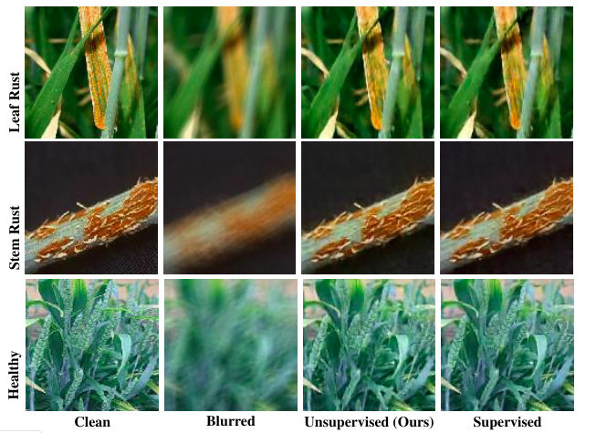
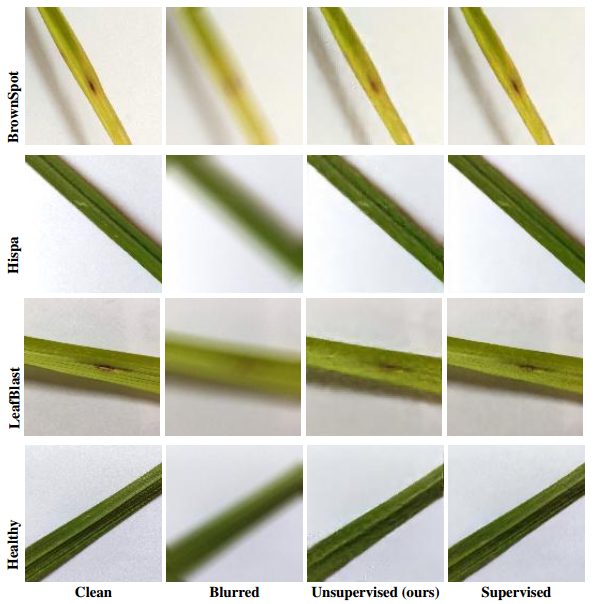

# Improving Crops Disease Classification
Our work has been accepted in Challenges & Opportunities for Computer Vision in Agriculture **CVPR Workshop, 2020.** 
  Titled **"Deep Unsupervised Deblurring Approach for Improving Crops Disease Classification"** 
 
## Summary:
Crop diseases pose a major threat to the world food security, and their timely identification is of utmost importance. However, the prevalence of distortion and motion blur in the crop images during image acquisition make image enhancement a mandatory step. Recently, deep learning-based approaches have shown the state of the art results for image enhancement. However, one critical limitation of these deep learning-based approaches is the requirement of high-quality noiseless ground truth images
that are difficult to obtain in many agricultural applications. To solve this issue, we leverage a recently proposed deep
learning-based approach that does not require ground-truth images to remove the motion blur. We show the effectiveness of our proposed approach on wheat and rice plant disease datasets.

## Code
**How to Run**
1. Run `make_txt.ipynb`  to get paths of images in the training set and your generated blur kernels.
2. Run `train_nonblind.ipynb`  for running unsupervised deblur algorithm (proposed in paper) for your dataset.
3. Run `train_supervised.ipynb`  for running supervised deblur algorithm (proposed in paper) for your dataset.
4. Run `train_classification_model.ipynb`to train any open source deep learning model on your dataset for disease classification
5. Run `blur_deblur_and_save.ipynb` to load test images, convolve with blur kernels and deblur with your trained model and then save  both into separate directories.
6. Run `test_classifier.ipynb` to load clean, blur and deblur (by supervised & unsupervised methods) test images and test your trained classification model.

## Experimental Results
**Qualitative Results on Wheat Crop**

  

**Qualitative Results on Rice Crop**

  

**Quantitative Results on Rice Crop**

  | Crops | Data   | PSNR  | SSIM  | GoogleNet | Resnet18 | Alexnet | VGG11   | Squeezenet | Densenet |
  | :---: 
| <td rowspan=4> Wheat | Clean  |  -    |  -    |  76.66%   |   84.16% |  78.33% |  68.33% |   83.33%   |  78.33%  
  |       | Blur   | 16.96 | 0.195 |  62.50%   |   71.66% |  59.16% |  46.66% |   65.00%   |  58.33%  |
  | | Unsupervised | 18.55 | 0.483 |  74.16%   |   75.83% |  76.66% |  67.50% |   77.50%   |  73.33%  |
  | | Supervised   | 18.90 | 0.494 |  75.06%   |   76.66% |  77.50% |  67.50% |   78.33%   |  74.16%  |
| <td rowspan=4> Rice  | Clean  |   -   |  -    |  78.12%   |   82.50% |  56.25% |  83.75% |   77.50%   |  81.87%  
  |       | Blur   | 22.52 | 0.73  |  31.25%   |   36.25% |  40.62% |  26.25% |   25.62%   |  30.00%  |
  | | Unsupervised | 29.63 | 0.852 |  53.75%   |   55.00% |  56.25% |  52.50% |   52.50%   |  57.50%  |
  | | Supervised   | 29.77 | 0.857 |  54.37%   |   51.25% |  53.75% |  56.25% |   46.83%   |  61.25%  |

